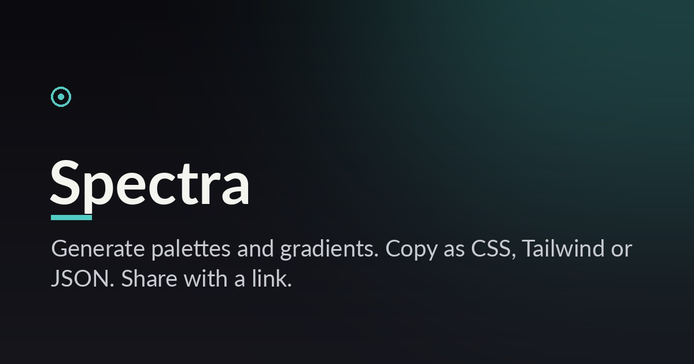

# Spectra

### Color palettes, instantly.

Generate beautiful color palettes and CSS gradients right in your browser. Lock the colors you
like, hit space to regenerate the rest, and copy everything as CSS variables, a Tailwind config or
JSON. Share any palette with a link.

**[ Live ](https://spectra.vercel.app)**



## Features

- Five-color palettes with real harmony schemes (analogous, triadic, complementary, monochrome)
- Lock individual colors, press `space` to regenerate the rest
- Click any swatch to copy its hex
- Export as CSS variables, Tailwind config, JSON, or a share URL
- A gradient studio with a live angle control and copyable CSS
- Palettes live in the URL, so sharing is just copying the link

## Make money with it
See [ACTIVATE.md](ACTIVATE.md).
- **Tips** from designers and developers (`VITE_TIP_URL`).
- **Affiliate** to design tools and courses (`VITE_AFF_GEAR`).
- Later: Pro palette packs and saved collections (`VITE_PRO_CHECKOUT`).

## Tech
React + TypeScript + Vite + Tailwind. Client-side, ~69 KB gzipped. Zero-config Vercel deploy.

```bash
npm install && npm run dev
```

MIT licensed. See [LICENSE](LICENSE).
